# 💰 CapitalDeck - Wealth Intelligence Platform

> **A comprehensive full-stack financial management system designed to track personal wealth, analyze spending habits, and manage investment portfolios with enterprise-grade security.**


---

## 📸 Screenshots

| **User Dashboard** | **Admin Dashboard** |
|:---:|:---:|
| 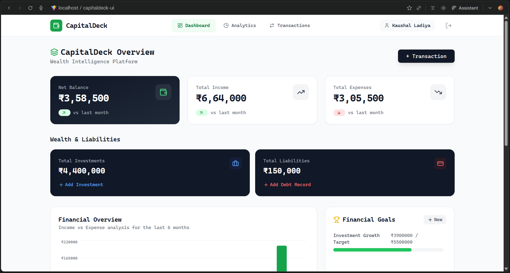 | 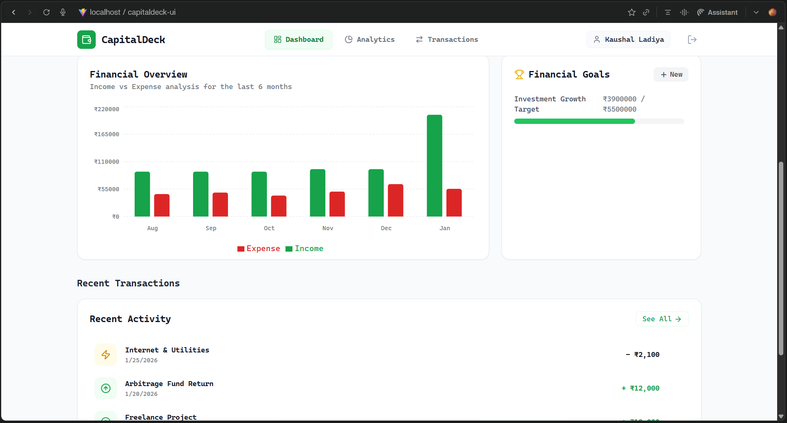 |
| *Real-time financial overview* | *Admin view with system controls* |

| **Analytics** | **Transaction History** |
|:---:|:---:|
| 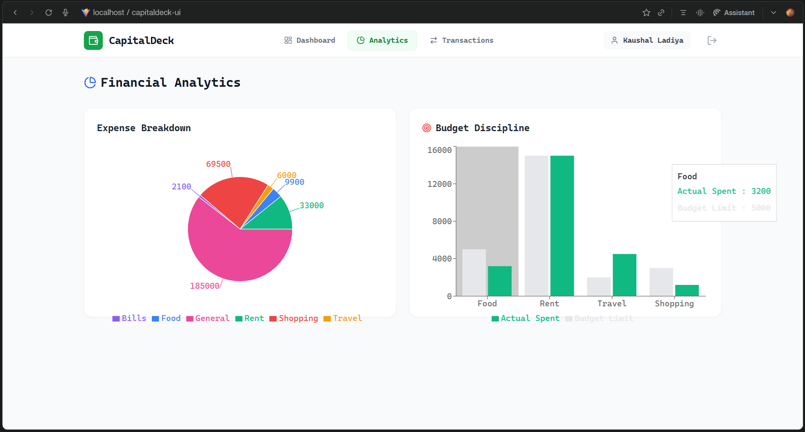 | 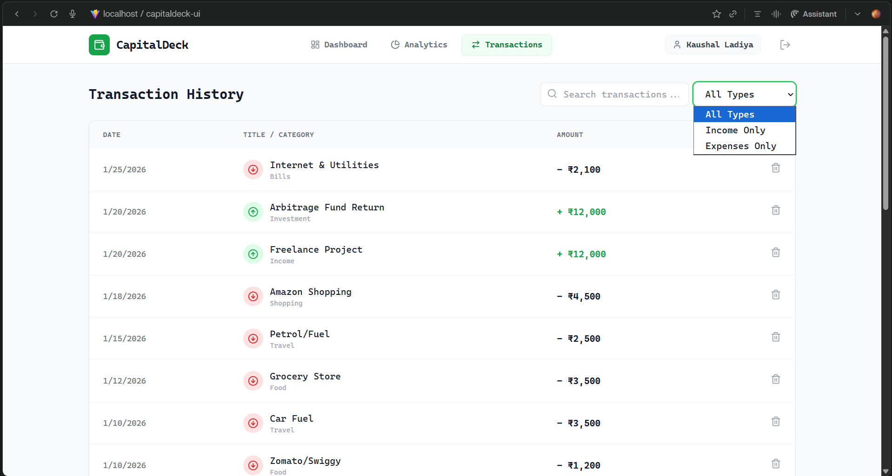 |
| *Expense breakdown & budget discipline* | *Searchable transaction list* |

| **Add Transaction** | **Financial Goals** |
|:---:|:---:|
| 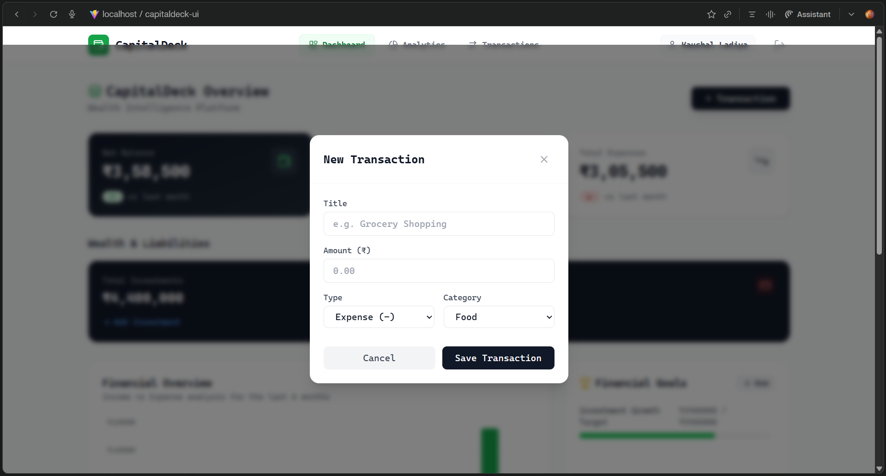 | 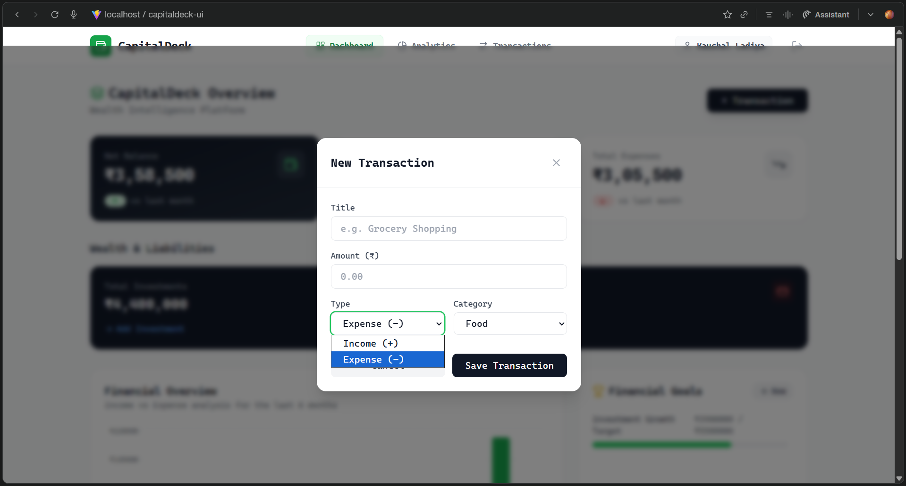 |
|  | 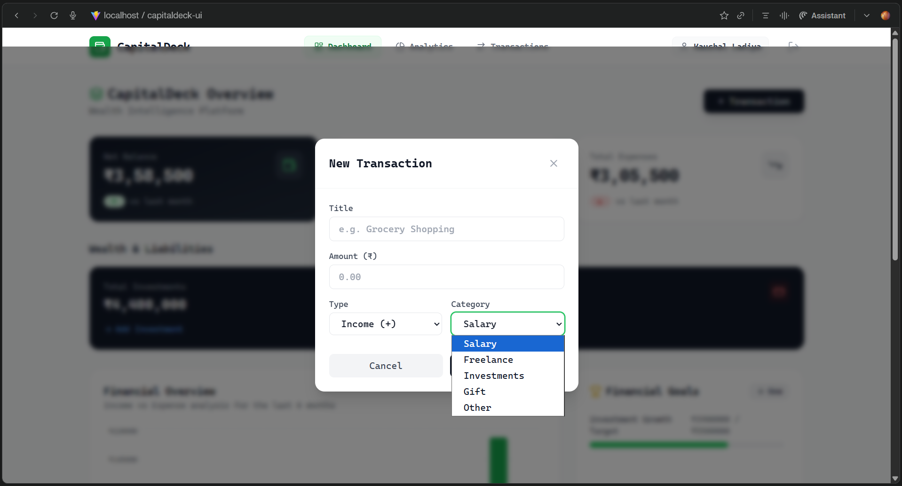 |
| *Smart category selection* | *Target tracking progress* |

| **Secure Login** | **Account Registration** |
|:---:|:---:|
| 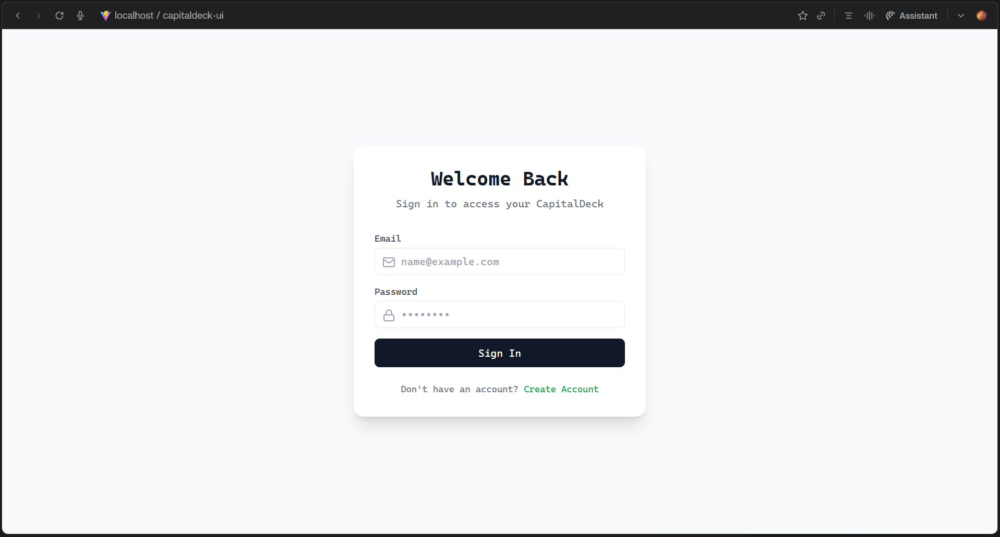 | 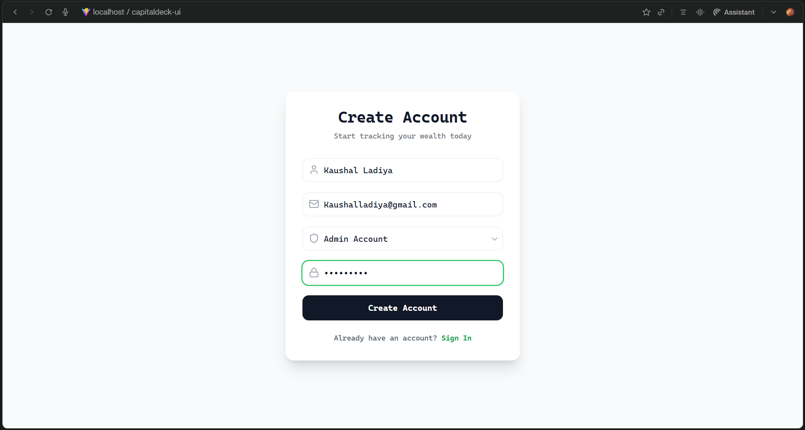 |
| *JWT Authentication* | *Role-based sign up* |

| **Database Schema** | **Backend Architecture** |
|:---:|:---:|
| 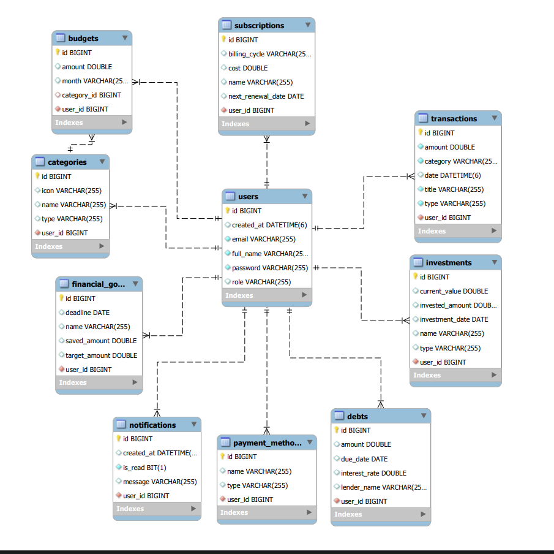 | 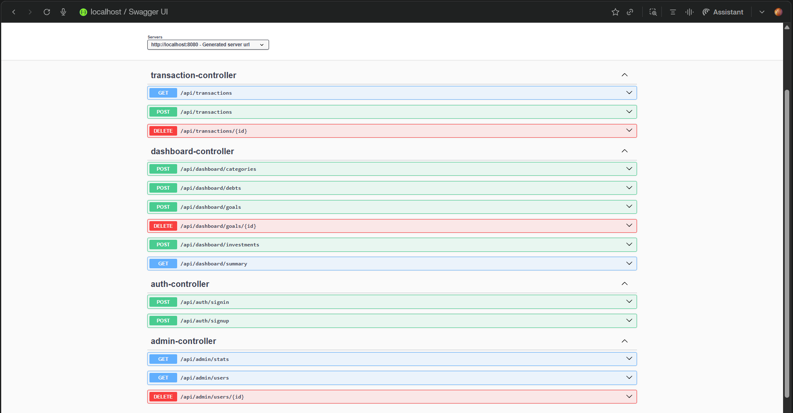 |
| *MySQL Users Table* | *Folder Structure* |

---

## ✨ Features

### 🔐 Security & Access Control
- **Role-Based Access Control (RBAC)**: Distinct portals for **Users** and **Admins**.
- **JWT Authentication**: Stateless, secure session management using JSON Web Tokens.
- **Data Isolation**: Strict server-side checks ensure users can only access their own financial data.
- **BCrypt Hashing**: Industry-standard password encryption.

### 👤 User Module (Personal Finance)
- **Wealth Command Center**: Track **Assets** (Investments) vs **Liabilities** (Debts) in real-time.
- **Transaction Management**: 
  - Smart categorization with dynamic icons (Food, Rent, Salary, etc.).
  - Search, Filter, and Delete capabilities.
- **Financial Goals**: Set targets (e.g., "Buy Car") and visualize saving progress.
- **Analytics**: "Income vs Expense" visualization using Recharts.
- **Data Export**: Download transaction history as CSV.

### 🛡️ Admin Module (System Management)
- **System Health**: Monitor total users, transaction volume, and server status.
- **User Management**: View user database and role distribution.
- **Moderation**: Ability to ban/delete users from the platform.

---

## 🎨 Design Philosophy

### Psychology of Money

This project utilizes specific design choices to build trust and clarity:

* **Visual Hierarchy**:
* **Dark Gradient**: Used for Total Balance to signify importance and solidity.
* **Green & Red**: Universally recognized signals for Profit (Income) and Loss (Expense).


* **Typography**:
* **Cascadia Code**: Used exclusively. The monospaced font implies "Calculation," "Accuracy," and "Terminal-like precision," similar to professional trading platforms like Zerodha.

---

## 🛠️ Tech Stack

### Backend (CapitalDeck.API)
- **Framework:** Spring Boot 3.2 (Java)
- **Security:** Spring Security 6 (JWT + BCrypt)
- **Database:** MySQL 8.0
- **ORM:** Hibernate / Spring Data JPA
- **API Documentation:** Swagger UI
- **Architecture:** Layered (Controller → Service → Repository)

### Frontend (CapitalDeck.UI)
- **Framework:** React 18.3 (Vite)
- **Styling:** Tailwind CSS 3.4
- **HTTP Client:** Axios (Interceptors for Bearer Tokens)
- **Visualization:** Recharts
- **Icons:** Lucide React

---

## 🗄 Database Schema (10 Tables)

The application moves beyond simple expense tracking by utilizing a normalized schema with **10 core entities**:

1.  **`users`**: Stores authentication credentials and Roles (`ROLE_USER`, `ROLE_ADMIN`).
2.  **`transactions`**: Core income and expense records linked to users.
3.  **`categories`**: Categorization logic for transactions.
4.  **`financial_goals`**: Savings targets with progress tracking.
5.  **`investments`**: Asset tracking (Stocks, Mutual Funds).
6.  **`debts`**: Liability tracking (Loans, EMIs).
7.  **`budgets`**: Monthly spending limits.
8.  **`subscriptions`**: Recurring payment tracking.
9.  **`payment_methods`**: Source of funds (Credit Card, Cash, UPI).
10. **`notifications`**: System alerts and reminders.

---

## 🚀 Getting Started

### Prerequisites
- [Java JDK 17+](https://adoptium.net/)
- [Maven](https://maven.apache.org/)
- [Node.js 18+](https://nodejs.org/)
- [MySQL Server](https://dev.mysql.com/downloads/installer/)

### Installation

1. **Clone the repository**
   ```bash
   git clone [https://github.com/kaushalladiya/CapitalDeck.git](https://github.com/kaushalladiya/CapitalDeck.git)
   cd CapitalDeck
   ```

2. **Configure Database**
   Open `CapitalDeck.API/src/main/resources/application.properties` and update:
   ```properties
   spring.datasource.url=jdbc:mysql://localhost:3306/capitaldeck_db?createDatabaseIfNotExist=true
   spring.datasource.username=YOUR_MYSQL_USERNAME
   spring.datasource.password=YOUR_MYSQL_PASSWORD
   spring.jpa.hibernate.ddl-auto=update
   ```

3. **Set up the Frontend**
   ```bash
   cd CapitalDeck.UI

   # Install dependencies
   npm install

   # Run the development server
   npm run dev
   ```
   Frontend will run on `http://localhost:5173`

4. **Set up the Backend** (Once implemented)
   ```bash
   cd ../CapitalDeck.API

   # Run the API
   ./mvnw spring-boot:run
   ```
   Backend will run on `http://localhost:8080`

5. **Open in browser**
   Navigate to `http://localhost:5173`

---

## 📁 Project Structure

```
CapitalDeck/
├── CapitalDeck.API/                # Spring Boot Backend
│   ├── src/main/java/com/capitaldeck/api/
│   │   ├── config/                 # Security & App Config
│   │   ├── controller/             # REST API Controllers (Admin, Auth, Dashboard)
│   │   ├── model/                  # Database Entities (User, Transaction, Goals)
│   │   ├── payload/                # Request/Response DTOs
│   │   ├── repository/             # JPA Repositories
│   │   └── security/               # JWT & UserDetails Logic
│   ├── src/main/resources/         # App Properties & Static Resources
│   └── pom.xml               # Maven Dependencies
│
└── CapitalDeck.UI/                 # React Frontend
    ├── src/
    │   ├── api/                    # Axios Services (Admin, Auth, Transaction)
    │   ├── components/             # Reusable UI (Cards, Charts, Modals)
    │   ├── pages/                  # Views (Dashboard, Login, AdminPanel)
    │   └── App.jsx                 # Main Router
    ├── public/                     # Static Assets
    └── tailwind.config.js          # Styling Config

```

---

## 🔌 API Endpoints Overview

| Module | Method | Endpoint | Description | Role |
| --- | --- | --- | --- | --- |
| **Auth** | `POST` | `/api/auth/signup` | Register (User/Admin) | Public |
| **Auth** | `POST` | `/api/auth/signin` | Login & Get Token | Public |
| **Dashboard** | `GET` | `/api/dashboard/summary` | Get Investments, Debts, Goals | User |
| **Transactions** | `GET` | `/api/transactions` | Get User's Transactions | User |
| **Transactions** | `POST` | `/api/transactions` | Create Transaction | User |
| **Goals** | `DELETE` | `/api/dashboard/goals/{id}` | Delete a Financial Goal | User |
| **Admin** | `GET` | `/api/admin/stats` | System Health Stats | **Admin** |
| **Admin** | `GET` | `/api/admin/users` | List All Users | **Admin** |
| **Admin** | `DELETE` | `/api/admin/users/{id}` | Ban User | **Admin** |

---

## 👨‍💻 Author

**Kaushal Ladiya**

* GitHub : [@kaushalladiya](https://www.google.com/search?q=https://github.com/kaushalladiya)
* LinkedIn : [@kaushalladiya](https://www.google.com/search?q=https://linkedin.com/in/kaushalladiya)

---

## 🙏 Acknowledgments

* Built as part of full-stack development learning journey
* Thanks to the Java(Spring) and React communities for excellent documentation
* Tailwind CSS for making styling enjoyable

---

**⭐ If you find this project helpful, please consider giving it a star!**